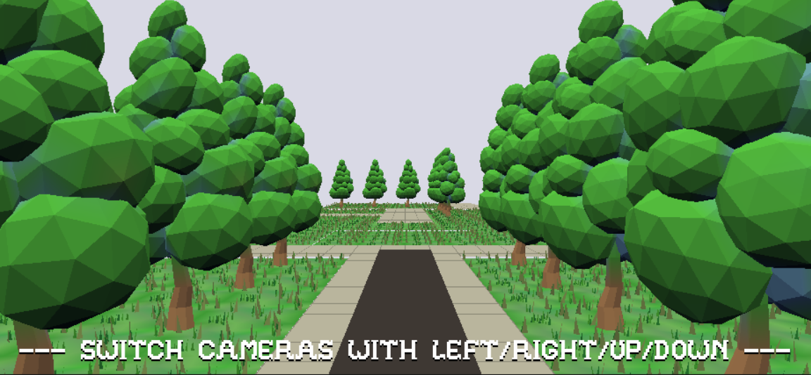

# (Maze game)

Author: (Jiechen Li)

Design: (TODO: In two sentences or fewer, describe what is new and interesting about your game.)

This is a very big maze!
You need to find a way out!
This time you are a ball! Control yourself move to different directions. I'll build fences to block you. Your target is moving to the destination!
(I have several onsite interviews this week. So I skipped this game. But I found a README and screenshot is worth 0.5pts. That's why I have a README here!)

Screen Shot:

How To Play:

You can use your keyboard to control your movement
'←' means you choose to go left.
'→' means you choose to go right.
'↑' means you choose to go up.
The target of this game to get out of this maze. This time these operations are no longer changing cameras. These operations will control your movement. You may encouter fences and rebound.

Sources:

Art Sources:
https://www.turbosquid.com/3d-models/blender-carrot-crystal-oak-tree-3d-model-1189852

This game was built with [NEST](NEST.md).